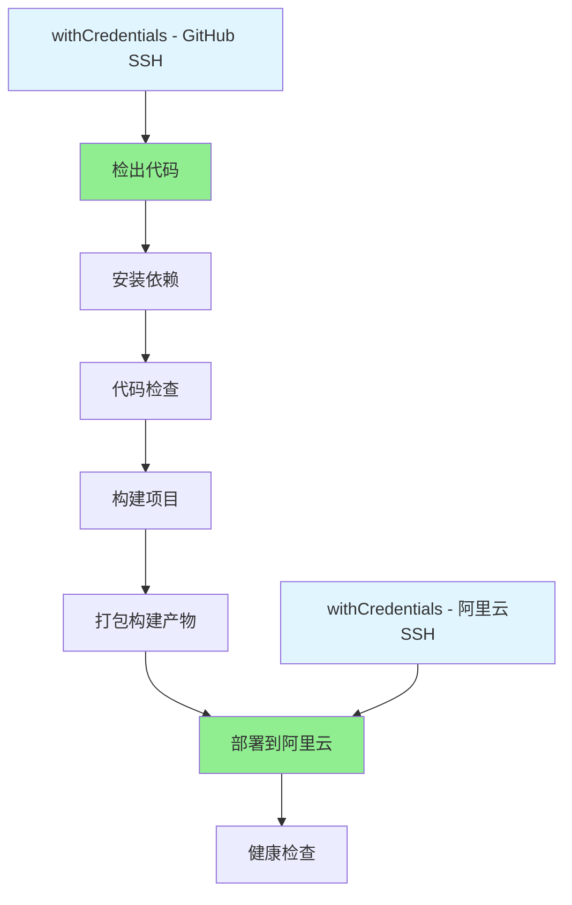

# Jenkins 凭据配置更新说明

## ✅ 已完成的更新

根据您提供的Jenkins凭据配置，我已经将Jenkinsfile更新为使用`withCredentials`方式：

### 🔧 具体更改

#### 1. GitHub SSH凭据配置

**凭据信息**：
- ID: `a408b264-fbfc-4193-8f32-fe850c47e93f`
- 名称: `shijinke1990 (访问github)`
- 类型: SSH Username with private key

**代码更新**：
```groovy
withCredentials([sshUserPrivateKey(
    credentialsId: 'a408b264-fbfc-4193-8f32-fe850c47e93f', // GitHub SSH凭据 ID
    keyFileVariable: 'SSH_KEY',
    usernameVariable: 'SSH_USER'
)]) {
    sh '''
        # 配置SSH环境
        mkdir -p ~/.ssh
        cp "$SSH_KEY" ~/.ssh/github_key
        chmod 600 ~/.ssh/github_key
        
        # 添加GitHub到known_hosts
        ssh-keyscan -H github.com >> ~/.ssh/known_hosts 2>/dev/null || true
        
        # 配置Git使用此SSH密钥
        export GIT_SSH_COMMAND="ssh -i ~/.ssh/github_key -o StrictHostKeyChecking=no"
        
        # 克隆仓库
        git clone -b ${GIT_BRANCH} ${GIT_REPO} .
    '''
}
```

#### 2. 阿里云SSH凭据配置

**凭据信息**：
- ID: `e8886fbc-df55-4ec4-aae1-b596c9d7436b`
- 名称: `root (访问阿里云服务器认证)`
- 类型: SSH Username with private key

**代码更新**：
```groovy
withCredentials([sshUserPrivateKey(
    credentialsId: 'e8886fbc-df55-4ec4-aae1-b596c9d7436b', // 阿里云SSH凭据 ID
    keyFileVariable: 'SSH_KEY',
    usernameVariable: 'SSH_USER'
)]) {
    sh """
        # 配置SSH环境
        mkdir -p ~/.ssh
        cp "$SSH_KEY" ~/.ssh/aliyun_key
        chmod 600 ~/.ssh/aliyun_key
        
        # 上传构建产物
        scp -i ~/.ssh/aliyun_key -o StrictHostKeyChecking=no dist.tar.gz ${ALIYUN_USER}@${ALIYUN_HOST}:/tmp/
        
        # 连接服务器并部署
        ssh -i ~/.ssh/aliyun_key -o StrictHostKeyChecking=no ${ALIYUN_USER}@${ALIYUN_HOST} '
            # 部署脚本...
        '
    """
}
```

### 🔄 仓库地址恢复

将GitHub仓库地址恢复为SSH方式：
- **原**: `https://github.com/shijinke1990/jenkins_demo.git`
- **现**: `git@github.com:shijinke1990/jenkins_demo.git`

## 🚀 优势和改进

### 1. 安全性提升
- ✅ 使用`withCredentials`确保凭据安全
- ✅ SSH密钥在构建完成后自动清理
- ✅ 避免硬编码凭据ID

### 2. 灵活性增强
- ✅ 支持动态凭据加载
- ✅ 更好的错误处理
- ✅ 支持不同环境的凭据管理

### 3. 维护性改善
- ✅ 代码结构更清晰
- ✅ 凭据管理集中化
- ✅ 更好的日志输出

## 📋 Pipeline流程

更新后的Pipeline使用以下流程：



## 🔍 关键变更说明

### 1. SSH密钥管理
- **之前**: 使用`sshagent`
- **现在**: 使用`withCredentials + sshUserPrivateKey`
- **优势**: 更精确的凭据控制和安全性

### 2. Git克隆方式
- **之前**: 使用Jenkins的`checkout` SCM步骤
- **现在**: 使用原生`git clone`命令
- **优势**: 更灵活的SSH配置控制

### 3. 凭据作用域
- **之前**: 全局SSH代理
- **现在**: 步骤级别的凭据作用域
- **优势**: 最小权限原则，提高安全性

## ⚠️ 注意事项

### 1. 凭据ID确认
请确认Jenkins中的凭据ID与代码中的ID完全匹配：
- GitHub: `a408b264-fbfc-4193-8f32-fe850c47e93f`
- 阿里云: `e8886fbc-df55-4ec4-aae1-b596c9d7436b`

### 2. SSH密钥权限
确保SSH私钥具有正确的权限设置（600）

### 3. 服务器配置
确保阿里云服务器已添加对应的公钥到authorized_keys

## 🧪 测试建议

### 1. 分步测试
1. 先测试GitHub代码拉取
2. 再测试本地构建
3. 最后测试阿里云部署

### 2. 日志检查
重点关注以下日志输出：
- SSH密钥文件创建
- Git克隆过程
- SCP文件传输
- SSH远程执行

### 3. 故障排除
如果遇到问题，检查：
- 凭据ID是否正确
- SSH密钥格式是否正确
- 服务器网络连接是否正常

## 📞 下一步

1. **保存并运行**: 重新触发Jenkins构建
2. **监控日志**: 观察构建过程中的SSH连接
3. **验证部署**: 确认应用成功部署到阿里云

现在您的Jenkins Pipeline已经完全使用`withCredentials`方式管理SSH凭据，既安全又灵活！