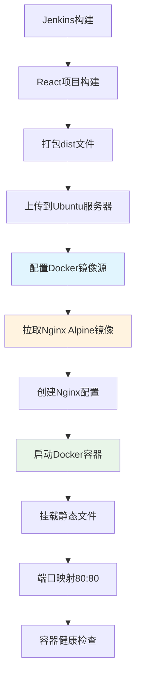

# Docker容器化部署指南

## 🎯 概述

本指南介绍如何使用Docker容器部署React前端项目，通过Nginx Alpine镜像提供Web服务。

## 🔧 部署架构



## 🐳 Docker配置

### 1. 镜像源配置

根据项目要求，自动配置`docker.1ms.run`为唯一镜像源：

```json
{
  "registry-mirrors": [
    "https://docker.1ms.run"
  ],
  "log-driver": "json-file",
  "log-opts": {
    "max-size": "10m",
    "max-file": "3"
  }
}
```

### 2. 使用的镜像

- **基础镜像**: `nginx:alpine`
- **镜像源**: `docker.1ms.run`
- **镜像特点**: 轻量级、安全、高效

## 📁 目录结构

服务器上的项目结构：

```
/opt/react-app/
├── dist/                 # React构建产物
│   ├── index.html
│   ├── assets/
│   └── ...
├── nginx.conf            # Nginx配置文件
└── dist.tar.gz          # 构建包（临时）
```

## ⚙️ Nginx配置

### 容器内Nginx配置特性

```nginx
server {
    listen 80;
    server_name _;
    root /usr/share/nginx/html;
    index index.html index.htm;
    
    # React Router支持
    location / {
        try_files $uri $uri/ /index.html;
    }
    
    # 静态资源缓存
    location ~* \.(js|css|png|jpg|jpeg|gif|ico|svg|woff|woff2|ttf|eot)$ {
        expires 1y;
        add_header Cache-Control "public, immutable";
        access_log off;
    }
    
    # Gzip压缩
    gzip on;
    gzip_comp_level 6;
    gzip_types text/plain text/css application/javascript;
    
    # 安全Headers
    add_header X-Frame-Options "SAMEORIGIN" always;
    add_header X-XSS-Protection "1; mode=block" always;
    add_header X-Content-Type-Options "nosniff" always;
}
```

## 🚀 容器启动参数

```bash
docker run -d \
    --name react-app-nginx \
    --restart unless-stopped \
    -p 80:80 \
    -v "/opt/react-app/dist:/usr/share/nginx/html:ro" \
    -v "/opt/react-app/nginx.conf:/etc/nginx/conf.d/default.conf:ro" \
    nginx:alpine
```

### 参数说明

- `--name react-app-nginx`: 容器名称
- `--restart unless-stopped`: 自动重启策略
- `-p 80:80`: 端口映射（宿主机80 → 容器80）
- `-v dist:/usr/share/nginx/html:ro`: 只读挂载静态文件
- `-v nginx.conf:/etc/nginx/conf.d/default.conf:ro`: 只读挂载配置文件

## 📊 部署流程详解

### 1. 环境检查阶段
```bash
# 检查Docker服务状态
docker info >/dev/null 2>&1

# 检查Docker镜像源配置
grep "docker.1ms.run" /etc/docker/daemon.json
```

### 2. 镜像准备阶段
```bash
# 配置镜像源（如需要）
systemctl restart docker

# 拉取Nginx Alpine镜像
docker pull nginx:alpine
```

### 3. 容器部署阶段
```bash
# 停止旧容器
docker stop react-app-nginx 2>/dev/null || true
docker rm react-app-nginx 2>/dev/null || true

# 启动新容器
docker run -d --name react-app-nginx \
    --restart unless-stopped \
    -p 80:80 \
    -v "/opt/react-app/dist:/usr/share/nginx/html:ro" \
    -v "/opt/react-app/nginx.conf:/etc/nginx/conf.d/default.conf:ro" \
    nginx:alpine
```

### 4. 健康检查阶段
```bash
# 检查容器状态
docker ps --filter name=react-app-nginx

# 检查容器日志
docker logs react-app-nginx

# 检查资源使用
docker stats --no-stream react-app-nginx

# HTTP访问测试
curl -s -o /dev/null -w '%{http_code}' http://localhost
```

## 🔍 监控和维护

### 1. 容器状态监控

```bash
# 查看容器状态
docker ps -a --filter name=react-app-nginx

# 查看容器详细信息
docker inspect react-app-nginx

# 查看容器资源使用
docker stats react-app-nginx
```

### 2. 日志管理

```bash
# 查看实时日志
docker logs -f react-app-nginx

# 查看最近50条日志
docker logs --tail 50 react-app-nginx

# 查看指定时间段日志
docker logs --since="2024-01-01T00:00:00" react-app-nginx
```

### 3. 容器维护

```bash
# 重启容器
docker restart react-app-nginx

# 进入容器调试
docker exec -it react-app-nginx sh

# 查看容器内文件
docker exec react-app-nginx ls -la /usr/share/nginx/html
```

## 🛠️ 故障排除

### 1. 容器启动失败

**症状**: 容器无法启动或立即退出

**排查步骤**:
```bash
# 查看容器日志
docker logs react-app-nginx

# 检查端口占用
netstat -tlnp | grep :80
lsof -i :80

# 检查挂载路径
ls -la /opt/react-app/dist/
ls -la /opt/react-app/nginx.conf
```

**常见原因**:
- 端口80被占用
- 挂载路径不存在
- Nginx配置文件语法错误
- 文件权限问题

### 2. 网站无法访问

**症状**: HTTP返回404或500错误

**排查步骤**:
```bash
# 检查容器状态
docker ps | grep react-app-nginx

# 检查挂载的静态文件
docker exec react-app-nginx ls -la /usr/share/nginx/html/

# 检查Nginx配置
docker exec react-app-nginx nginx -t

# 测试容器内部访问
docker exec react-app-nginx curl -I localhost
```

### 3. 性能问题

**症状**: 网站访问缓慢

**优化措施**:
```bash
# 检查容器资源使用
docker stats react-app-nginx

# 优化Nginx配置
# - 启用Gzip压缩
# - 配置静态资源缓存
# - 调整worker进程数

# 检查磁盘IO
iostat -x 1 5
```

## 📈 性能优化

### 1. 镜像优化

- ✅ 使用Alpine版本（体积小）
- ✅ 多阶段构建（如需要）
- ✅ 减少镜像层数

### 2. 配置优化

- ✅ Gzip压缩
- ✅ 静态资源缓存
- ✅ Keep-Alive连接
- ✅ 安全Headers

### 3. 容器优化

- ✅ 资源限制配置
- ✅ 健康检查配置
- ✅ 日志轮转配置

## 🔒 安全配置

### 1. 容器安全

```bash
# 只读文件系统挂载
-v "/opt/react-app/dist:/usr/share/nginx/html:ro"

# 非特权用户运行
--user nginx:nginx

# 资源限制
--memory="256m" --cpus="0.5"
```

### 2. 网络安全

- ✅ 安全Headers配置
- ✅ 隐藏服务器版本信息
- ✅ 防止点击劫持
- ✅ XSS攻击防护

## 🎯 优势特点

### 1. 容器化优势

- ✅ **环境一致性**: 开发、测试、生产环境完全一致
- ✅ **快速部署**: 秒级启动，快速回滚
- ✅ **资源隔离**: 独立的运行环境
- ✅ **易于扩展**: 支持水平扩展

### 2. Alpine镜像优势

- ✅ **轻量级**: 镜像体积仅5MB左右
- ✅ **安全性**: 最小化攻击面
- ✅ **高效**: 启动速度快，资源消耗低

### 3. 配置管理优势

- ✅ **版本控制**: 配置文件纳入版本管理
- ✅ **动态更新**: 无需重建镜像即可更新配置
- ✅ **统一管理**: 集中管理所有配置

## 📞 下一步操作

1. **运行Pipeline**: 触发Jenkins构建，观察Docker部署过程
2. **验证访问**: 访问 `http://您的服务器IP` 验证部署效果
3. **监控容器**: 使用Docker命令监控容器状态
4. **性能测试**: 测试网站响应速度和功能完整性

现在您的React项目将运行在轻量级、高性能的Docker Nginx容器中！