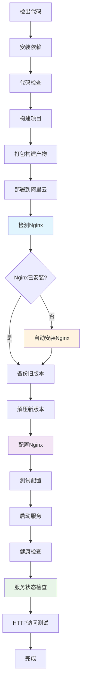

# Nginx 自动安装与配置说明

## ✅ 新增功能

我已经为您的Jenkins Pipeline添加了自动Nginx安装和配置功能，确保React项目能够被正确访问。

### 🔧 主要功能

#### 1. 自动检测和安装Nginx

**支持的系统**：
- ✅ **Ubuntu/Debian**: 使用 `apt-get`
- ✅ **CentOS/RHEL**: 使用 `yum` 或 `dnf`
- ✅ **Alpine Linux**: 使用 `apk`

**安装逻辑**：
```bash
if ! command -v nginx > /dev/null; then
    echo "Nginx未安装，开始安装..."
    # 根据系统类型选择包管理器
    if [ -f /etc/debian_version ]; then
        apt-get update && apt-get install -y nginx
    elif [ -f /etc/redhat-release ]; then
        yum install -y nginx || dnf install -y nginx
    elif [ -f /etc/alpine-release ]; then
        apk update && apk add nginx
    fi
fi
```

#### 2. 智能Nginx配置

**配置特性**：
- ✅ **React Router支持**: `try_files $uri $uri/ /index.html`
- ✅ **Gzip压缩**: 自动压缩静态资源
- ✅ **静态资源缓存**: CSS/JS/图片等资源1年缓存
- ✅ **安全Headers**: XSS保护、内容类型检测等
- ✅ **错误页面处理**: 404自动跳转到index.html

**生成的配置文件**：
```nginx
server {
    listen 80;
    server_name _;
    root /var/www/html;
    index index.html index.htm;
    
    # 启用Gzip压缩
    gzip on;
    gzip_vary on;
    gzip_min_length 1024;
    gzip_comp_level 6;
    gzip_types text/plain text/css text/javascript application/json application/javascript;
    
    # 处理React Router的前端路由
    location / {
        try_files $uri $uri/ /index.html;
    }
    
    # 静态资源缓存
    location ~* \.(js|css|png|jpg|jpeg|gif|ico|svg|woff|woff2|ttf|eot)$ {
        expires 1y;
        add_header Cache-Control "public, immutable";
        access_log off;
    }
    
    # 安全headers
    add_header X-Frame-Options "SAMEORIGIN" always;
    add_header X-XSS-Protection "1; mode=block" always;
    add_header X-Content-Type-Options "nosniff" always;
    
    # 错误页面处理
    error_page 404 /index.html;
}
```

#### 3. 智能配置部署

**配置文件位置**：
- **Ubuntu/Debian**: `/etc/nginx/sites-available/react-app` + 软链接到 `sites-enabled`
- **CentOS/RHEL**: `/etc/nginx/conf.d/react-app.conf`

**自动处理**：
- ✅ 删除默认配置文件
- ✅ 创建专用配置
- ✅ 测试配置语法
- ✅ 启用和启动服务

#### 4. 服务管理

**服务操作**：
```bash
# 启用开机自启动
systemctl enable nginx

# 启动服务
systemctl start nginx

# 重载配置
systemctl reload nginx

# 检查服务状态
systemctl is-active nginx
```

### 🔍 增强的健康检查

#### 1. 服务状态检查
- ✅ **Nginx服务状态**: 检查是否运行
- ✅ **端口监听**: 确认80端口被Nginx监听
- ✅ **配置语法**: 验证nginx.conf语法正确

#### 2. 部署文件检查
- ✅ **文件存在性**: 确认index.html存在
- ✅ **文件权限**: 检查文件权限设置
- ✅ **目录大小**: 显示部署目录大小和文件数量

#### 3. HTTP访问测试
- ✅ **主页访问**: 测试根路径返回200
- ✅ **静态资源**: 测试assets目录可访问
- ✅ **详细错误分析**: 根据HTTP状态码提供具体建议

### 📊 部署流程图



### 🛠️ 权限处理

**用户权限适配**：
```bash
# 尝试设置www-data用户（Ubuntu/Debian）
chown -R www-data:www-data /var/www/html 2>/dev/null ||
# 尝试设置nginx用户（CentOS/RHEL）  
chown -R nginx:nginx /var/www/html 2>/dev/null ||
# 保持当前用户权限
true
```

**文件权限**：
- 目录权限: `755`
- 文件权限: `644`

### 🔧 故障排除

#### 常见问题和解决方案

**1. Nginx安装失败**
```bash
# 检查系统类型
cat /etc/os-release

# 手动安装
sudo apt-get update && sudo apt-get install -y nginx  # Ubuntu/Debian
sudo yum install -y nginx                             # CentOS 7
sudo dnf install -y nginx                             # CentOS 8+
```

**2. 配置语法错误**
```bash
# 测试配置
nginx -t

# 查看详细错误
nginx -t -c /etc/nginx/nginx.conf
```

**3. 服务启动失败**
```bash
# 查看服务状态
systemctl status nginx

# 查看错误日志
journalctl -u nginx -f

# 查看Nginx错误日志
tail -f /var/log/nginx/error.log
```

**4. 权限问题**
```bash
# 检查文件权限
ls -la /var/www/html/

# 修复权限
sudo chown -R www-data:www-data /var/www/html/
sudo chmod -R 755 /var/www/html/
```

### 📈 性能优化

**已配置的优化**：
- ✅ **Gzip压缩**: 减少传输大小
- ✅ **静态资源缓存**: 减少重复请求
- ✅ **访问日志优化**: 静态资源不记录访问日志
- ✅ **Keep-Alive**: 复用连接减少开销

### 🔒 安全配置

**安全Headers**：
- ✅ **X-Frame-Options**: 防止点击劫持
- ✅ **X-XSS-Protection**: XSS攻击保护
- ✅ **X-Content-Type-Options**: MIME类型检测
- ✅ **Content-Security-Policy**: 内容安全策略
- ✅ **Server-Tokens**: 隐藏Nginx版本信息

### 🎯 适用场景

**完美适配**：
- ✅ React单页应用（SPA）
- ✅ Vue.js单页应用
- ✅ Angular应用
- ✅ 静态网站部署

**特殊处理**：
- ✅ 前端路由自动回退到index.html
- ✅ API代理配置（已预留配置模板）
- ✅ 多环境部署支持

### 📞 下一步

1. **运行Pipeline**: 重新触发构建，观察Nginx自动安装过程
2. **验证访问**: 构建完成后访问 `http://您的服务器IP`
3. **监控日志**: 查看Jenkins构建日志中的Nginx配置过程
4. **性能测试**: 使用浏览器开发者工具检查缓存和压缩效果

现在您的Jenkins Pipeline将自动处理Nginx的安装、配置和优化，确保React项目可以被正确访问！